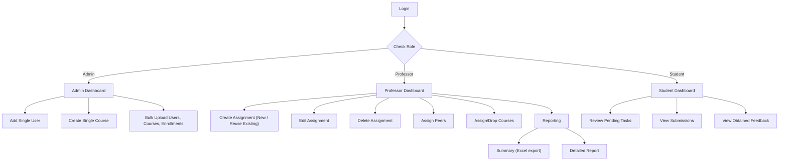

# Peer Assessment System

A Java-based **Peer Assessment System** for creating and managing review assignments.  
Built with Play Framework, JPA/Hibernate, Scala, HTML, BootStrap 5 and JavaScript.

---

## Table of Contents

- [Features](#features)
- [Architecture](#architecture)
- [Tech Stack](#tech-stack)
- [Getting Started](#getting-started)
    - [Prerequisites](#prerequisites)
    - [Installation](#installation)
    - [Configuration](#configuration)
    - [Running the App](#running-the-app)
- [Usage](#usage)
- [Contributing](#contributing)
- [License](#license)
- [Contact](#contact)

---

## Features

- **CRUD** operations for courses, assignments, feedback questions, and review tasks
- **Auto-assignment of peers** by parsing Moodle Group CSV files into review tasks
- **Asynchronous** using `CompletableFuture` for improved scalability and performance
- **JPA/Hibernate** for ORM and Play Framework for web layer
- **Modular frontend** using plain JS + Bootstrap: `ApiService` / `UiService` / `EventHandlers`

---

## Architecture

## System Architecture



1. **Backend**
    - Controllers (`CoreServiceController`, `FileUploadController`, etc.)
    - Services (`AssignmentServiceImpl`, `ReviewTaskServiceImpl`)
    - Repositories (`AssignmentRepository`, `CourseRepository`)
2. **Frontend**
    - Plain HTML & Bootstrap modals
    - `ApiService` for REST calls
    - `UiService` and `EventHandlers` for DOM updates
3. **Database**
    - PostgreSQL 17
    - Entities: `Assignment`, `ReviewTask`, `FeedbackQuestion`, etc.

---

## Tech Stack

- **Java 17** & **Play Framework 3.0.7**
- **Scala** (SBT build)
- **Hibernate** / **JPA**
- **JavaScript** (ES6) & **Bootstrap 5**
- **PostgreSQL 17**
- **GitHub Actions** for CI/CD

---

## Getting Started

### Prerequisites

- Java 17+
- SBT
- PostgreSQL (configured and running)

### Installation

1. Clone the repo
   ```bash
   git clone https://github.com/amalsaji25/peer-assessment.git
   cd peer-assessment
    ```
2. Build the project using SBT:
   ```bash
   sbt compile
   ```
3. Run the application:
   ```bash
   sbt run
   ```
4. open http://localhost:9000 in your browser.

5. First-time setup – create an initial admin user directly in your database. For example:
```bash
    INSERT INTO USERS
    VALUES(Admin ID,'Email','First_Name','Last_Name','encrypted password','admin')
```

6. Log in as admin at http://localhost:9000.
7. In the Admin Dashboard, use the UI to add professors as users.
8. Professors can now log in at http://localhost:9000/login to access their respective dashboards.
## Database Configuration
Ensure your database is configured properly in the `application.conf` file. Example:
```properties
db.default.driver=<database-driver>
db.default.url=<database-url>
db.default.username=<database-username>
db.default.password=<database-password>
```

## Contributing
1. Fork the repository.
2. Create a new branch for your feature or bug fix.
3. Submit a pull request with a detailed description of your changes.

## License


## Contact
Amal Saji – amalsaji25@gmail.com